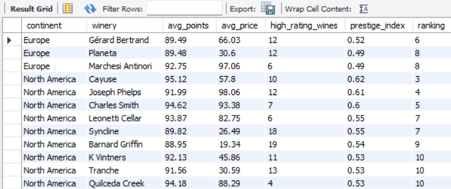
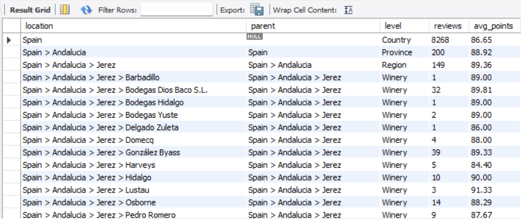

# Deep Dive Analysis of Wine Reviews

## 1. Wine Varieties that have consistently high rating

### Objective: 
1. Identify Wine varities that are above median price in both Europe and North America.
2. Compare their mean prices and reviews 


### Analysis
1. A wine variety, in order to be highly rated, must be above the median rating in not just one but both the continents.
2. The first step is therefore to find the median points for each continent and compare a variety's mean rating against it.

Finding the continental median

```sql
# Find Mean, Median, Mode for Europe

select 'Mean' as Statistic, round(avg(points),2) as 'Value' 
from wine_reviews

union all

select 'Median', round(avg(points),0) as 'Value' from (
	select points, @rownum:= @rownum+1 as 'row_number', @total_rows:= @rownum
    from wine_reviews m, (select @rownum:=0) r
    where m.points is not null and m.continent = 'Europe'
    order by m.points
)as temp 
where temp.row_number in (floor((@total_rows+1)/2),floor((@total_rows+2)/2))

union all

select 'Mode' as Statistic, points as 'Value' from
(
select points, count(*) from wine_reviews group by points order by count(*) desc
limit 1
)t; 

```
Output:
| Statistic | Value |
|-----------|-------|
| Mean      | 87.89 |
| Median    | 88    |
| Mode      | 87    |


```sql

# Find Mean, Median, Mode for NAmerica

select 'Mean' as Statistic, round(avg(points),2) as 'Value' 
from wine_reviews

union all

select 'Median', round(avg(points),0) as 'Value' from (
	select points, @rownum:= @rownum+1 as 'row_number', @total_rows:= @rownum
    from wine_reviews m, (select @rownum:=0) r
    where m.points is not null and m.continent = 'North America'
    order by m.points
)as temp 
where temp.row_number in (floor((@total_rows+1)/2),floor((@total_rows+2)/2))

union all

select 'Mode' as Statistic, points as 'Value' from
(
select points, count(*) from wine_reviews group by points order by count(*) desc
limit 1
)t;

```
Output:

| Statistic | Value |
|-----------|-------|
| Mean      | 87.89 |
| Median    | 88    |
| Mode      | 87    |


Storing this information in a separate table - wine_superlatives, for easy access.

```sql
# Finding the Wine varieties with median greater than continental median.
with cte_europe as (
select  a.variety as Europe_Variety, round(avg(a.points),2) Europe_avg, avg(b.value) as Europe_med, 
count(*) Europe_count, round(avg(prices),2) as Europe_price,
case 
	when round(avg(a.points),2) >= avg(b.value) then 'y'
    else 'n' end as Above_Europe_Median
from wine_reviews a join wine_superlatives b 
on a.continent = b.continent 
and b.statistic ='Median'
and a.continent ='Europe'
group by a.continent, a.variety
having count(*) > 100
order by round(avg(a.points),2) desc
)
,

cte_NAmerica as (
select  a.variety as NAmerica_Variety, round(avg(a.points),2) NAmerica_avg, avg(b.value) as NAmerica_med,
count(*) NAmerica_count, round(avg(prices),2) as NAmerica_price,
case 
	when round(avg(a.points),2) >= avg(b.value) then 'y'
    else 'n' end as Above_North_American_Median
from wine_reviews a join wine_superlatives b 
on a.continent = b.continent 
and b.statistic ='Median'
and a.continent ='North America'
group by a.continent, a.variety
having count(*) > 100
order by round(avg(a.points),2) desc
) 
,
cte_Europe_NAmerica as (
select * from  cte_europe e left join cte_NAmerica n on e.Europe_Variety = n.NAmerica_Variety
union
select * from  cte_europe e right join cte_NAmerica n on e.Europe_Variety = n.NAmerica_Variety
)

select Europe_Variety,NAmerica_avg, Europe_avg, 
	NAmerica_med AS NAmerica_median, Europe_med as Europe_median, 
    NAmerica_price, Europe_price,
    round(NAmerica_price/NAmerica_avg,2) as NAmerican_PPR,
    round(Europe_price/Europe_avg,2) as Europe_PPR,
	NAmerica_count as NA_reviews, Europe_count as Europe_reviews
from cte_Europe_NAmerica
where Europe_Variety is not null
	and NAmerica_Variety is not null
	and Above_North_American_Median ='y'
	and Above_Europe_Median ='y'
order by NAmerica_avg desc, Europe_avg desc

```
Output:


### Insights:
1. All 4 varieties are rated above their local median in NA & EU, they are universally liked. 
2. BSRW - is 35% lesser in Europe, could be explored for export to the NA due to this price difference.
3. Syrah – Same rating in both continents, but in Europe it is on the expensive side. This could be a due to higher production cost. 
4. Malbec – Europe has better quality and lower price
5. Pinot Noir - price is stable across regions


## 2. Ranking Wineries on Prestige Index

### Objective:
1. Create a measure to gauge each Winery based on its rating, price and score
2. Use this measure to indentify top wineries in each continent.

### Analysis:
1. A winery can be in 2 different continents, it can a prestige index for each continent. There are 36 such Wineries in the dataset with US & EU as locations
2. US has 4800+ wineries & Europe has 8000+ wineries. Not all wineries can be used in this study. 
Let us narrow down to wineries with the greater appeal - wineries with >10 reviews.
Below is a winery distribution profile with NA as an example 
Finding the distribution of the wineries by review counts.

| **Bins**   | **1** | **1-9** | **10-99** | **100-499** | **>=500** | **Total** |
|--------------|--------|--------|-----------|-------------|-----------|-----------|
| **Review #** | 844 | 2334	| 1583  | 60      | 0      | 4821      |
| **Review %** | 18 | 48  | 33     | 1        | 0      | 100       |

~70% of the wineries have less than 10 reviews. 
For this case study we will only consider wineries with reviews >=10 in a continent.

```sql
#create table wine.top_wineriesNAEU(continent varchar(255), winery varchar(255), reviews int );


#Truncate table wine.top_wineriesNAEU;
/*
# insert into created table. 
insert into wine.top_wineriesNAEU(continent,winery,reviews )
with cte_t1 as (
select continent, winery, count(*) as reviews
from wine_reviews 
where continent in ('North America')  #, 'Europe')
group by continent, winery
having count(*) >=10
) #1643
,
cte_t2 as (
select continent, winery, count(*) as reviews
from wine_reviews 
where continent in ('Europe')
group by continent, winery
having count(*) >=10
)#1952


select * from cte_t1
union all 
select * from cte_t2;
*/
# computing avg price, avg points, count of high quality wines 

with cte_t1 as (
/* Query to find the count of wines with points above median (88 for both NA & EU)*/
select continent, winery, count(variety) as high_rating_wines from (
select continent, winery, variety,
sum(case when points >=88 then 1 else 0 end) as high_rating_variety, 
count(*) as total_reviews
from wine_reviews 
where continent in ( 'North America', 'Europe')
group by continent, winery, variety
having sum(case when points >=88 then 1 else 0 end)>0
order by winery, high_rating_variety
)t group by continent, winery
order by winery, high_rating_wines desc
)

select m.continent, m.winery, round(avg(m.points),2) as avg_points, round(avg(m.prices),2) as avg_price, 
round(avg(r.high_rating_wines),0) as High_rating_wines
from wine_reviews m 
join top_wineriesNAEU t on m.continent = t.continent and m.winery = t.winery
left join cte_t1 r on m.continent = r.continent and m.winery = r.winery
group by m.continent, m.winery
order by continent, high_rating_wines desc, avg_points desc, avg_price desc;


*/ 
# continuing from the previous query

# computing the normalized scores & Prestige_index and ranking them. 

with cte_t1 as (
# Query CTE_T1 is used to find the count of wines with points above median (88 for both NA & EU)*/
select continent, winery, count(variety) as high_rating_wines from (
select continent, winery, variety,
sum(case when points >=88 then 1 else 0 end) as high_rating_variety, 
count(*) as total_reviews
from wine_reviews 
where continent in ( 'North America', 'Europe')
group by continent, winery, variety
having sum(case when points >=88 then 1 else 0 end)>0
order by winery, high_rating_variety
)t group by continent, winery
order by winery, high_rating_wines desc
)
,
cte_t2 as ( # wine_reviews tbl inner joins with top_wineriesNAEU tbl to find only the wineries that have >10 reviews & 
#inner join with the above tbl to find no.of wines
select m.continent, m.winery, round(avg(m.points),2) as avg_points, round(avg(m.prices),2) as avg_price, 
round(avg(r.high_rating_wines),0) as High_rating_wines
from wine_reviews m 
join top_wineriesNAEU t on m.continent = t.continent and m.winery = t.winery
left join cte_t1 r on m.continent = r.continent and m.winery = r.winery
group by m.continent, m.winery
order by continent, high_rating_wines desc, avg_points desc, avg_price desc
)
,

cte_t3 as (
select continent, winery, avg_points, avg_price, high_rating_wines,
(avg_points - min(avg_points) over (partition by continent)) / (max(avg_points) over (partition by continent) - min(avg_points) over (partition by continent)) as norm_points,
(avg_price - min(avg_price) over (partition by continent)) / (max(avg_price) over (partition by continent) - min(avg_price) over (partition by continent)) as norm_price,
(high_rating_wines - min(high_rating_wines) over (partition by continent)) / (max(high_rating_wines) over (partition by continent) - min(high_rating_wines) over (partition by continent)) as norm_count
from cte_t2
)
,
cte_t4 as (
select continent, winery, avg_points, avg_price, high_rating_wines, 
	round((0.4*norm_points + 0.3*norm_price + 0.3*norm_count),2) as prestige_index
from cte_t3
order by continent, prestige_index desc
)

select continent, winery, avg_points, avg_price, high_rating_wines, prestige_index,
rank() over (partition by continent order by prestige_index desc) as ranking
from cte_t4
;


### Creating a permanent table for Prestige Index, so it can used for visualization

create table winery_PrestigeIndex (
	continent varchar(255),
    winery varchar(255),
    avg_points double,
    avg_price double,
    high_rating_wines int,
    prestige_index double,
    ranking int
    );

#drop table winery_PrestigeIndex

insert into winery_PrestigeIndex()
with cte_t1 as (
# Query CTE_T1 is used to find the count of wines with points above median (88 for both NA & EU)*/
select continent, winery, count(variety) as high_rating_wines from (
select continent, winery, variety,
sum(case when points >=88 then 1 else 0 end) as high_rating_variety, 
count(*) as total_reviews
from wine_reviews 
where continent in ( 'North America', 'Europe')
group by continent, winery, variety
having sum(case when points >=88 then 1 else 0 end)>0
order by winery, high_rating_variety
)t group by continent, winery
order by winery, high_rating_wines desc
)
,
cte_t2 as ( # wine_reviews tbl inner joins with top_wineriesNAEU tbl to find only the wineries that have >10 reviews & 
#inner join with the above tbl to find no.of wines
select m.continent, m.winery, round(avg(m.points),2) as avg_points, round(avg(m.prices),2) as avg_price, 
round(avg(r.high_rating_wines),0) as High_rating_wines
from wine_reviews m 
join top_wineriesNAEU t on m.continent = t.continent and m.winery = t.winery
left join cte_t1 r on m.continent = r.continent and m.winery = r.winery
group by m.continent, m.winery
order by continent, high_rating_wines desc, avg_points desc, avg_price desc
)
,

cte_t3 as (
select continent, winery, avg_points, avg_price, high_rating_wines,
(avg_points - min(avg_points) over (partition by continent)) / (max(avg_points) over (partition by continent) - min(avg_points) over (partition by continent)) as norm_points,
(avg_price - min(avg_price) over (partition by continent)) / (max(avg_price) over (partition by continent) - min(avg_price) over (partition by continent)) as norm_price,
(high_rating_wines - min(high_rating_wines) over (partition by continent)) / (max(high_rating_wines) over (partition by continent) - min(high_rating_wines) over (partition by continent)) as norm_count
from cte_t2
)
,
cte_t4 as (
select continent, winery, avg_points, avg_price, high_rating_wines, 
	round((0.4*norm_points + 0.3*norm_price + 0.3*norm_count),2) as prestige_index
from cte_t3
order by continent, prestige_index desc

select continent, winery, avg_points, avg_price, high_rating_wines, prestige_index,
rank() over (partition by continent order by prestige_index desc) as ranking
from cte_t4
;

```

```sql

select * from winery_PrestigeIndex where avg_price <= 100 and ranking <=10
order by continent, ranking

```
Output:



### Insights:
1. Europe:
   - Gérard Bertrand - Has good price and quality
   - Planeta - offers similar quality as GB but at lower price
   - Marchesi Antinori - High premium price, but has lesser no. of highly rated wines

2. North America:
   - Cayuse - Tops in prestige, moderate price.
   - Joseph Phelps and Charles Smith - high-quality & high price, good rating
   - Syncline and Barnard Griffin - high rated wines at low price - deal clinchers
 
## Q3 Geographical Hierarchy of Wine production

### Objective:
1. To trace the origin of a winery to its country.
2. Display review counts and scores

```sql
select * from 
(select 
country as location,
NULL as parent,
'Country' as level,
count(*) as reviews, round(avg(points),2) as avg_points
from wine_reviews
group by country

union all 

select 
concat(country,' > ',province) as location,
country as parent,
'Province' as level,
count(*) as reviews, round(avg(points),2) as avg_points
from wine_reviews
where province is not null
group by country, province

UNION ALL

select 
concat(country,' > ',province,' > ', region_1) as location,
concat(country,' > ',province) as parent,
'Region' as level,
count(*) as reviews, round(avg(points),2) as avg_points
from wine_reviews
where region_1 is not null and province is not null
group by country, province, region_1

union all

select 
concat(country,' > ',province,' > ',region_1,' > ',winery) as parent,
concat(country,' > ',province,' > ',region_1) as parent,
'Winery' as level,
count(*) as reviews, round(avg(points),2) as avg_points
from wine_reviews
where region_1 is not null and province is not null and winery is not null
group by country, province,region_1,winery
)hierarchy
where location like 'Spain%'
order by location
```
Output:
For Spain





